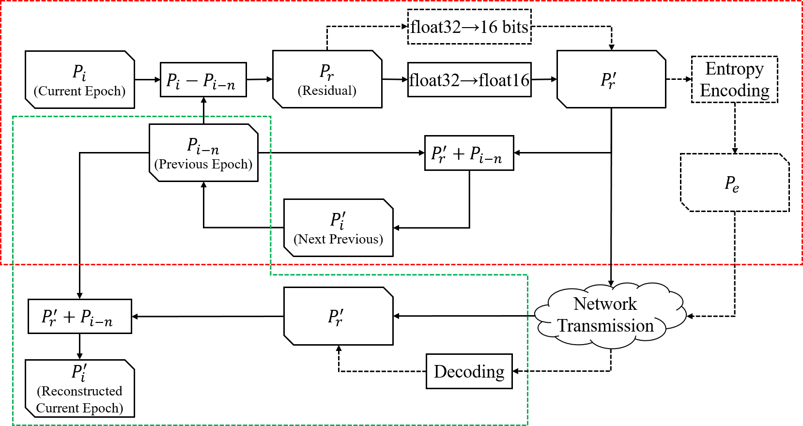
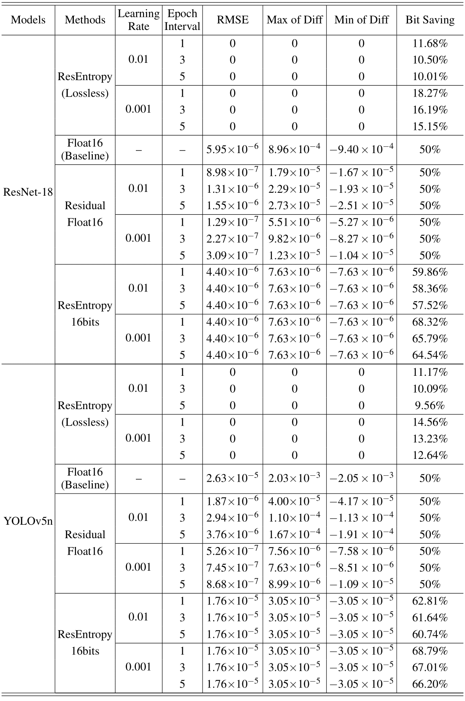

# DNN Model Residual Encoding Framework for Fast Parameter Transfer

This repository is the official implementation of 《DNN Model Residual Encoding Framework for Fast Parameter Transfer》



## Requirements

To install requirements:

```requirements
pip install -r requirements.txt
```
## Setup

To compile entropy encoding and decoding algorithms:
```setup
cd codec
python setup.py build_ext --inplace
```

## Compress Demo

A demo for compress parameters:

```demo
python demo.py --pre-epoch 'weights/yolov5n/21_0.01.pt' --cur-epoch 'weights/yolov5n/24_0.01.pt' --dnn 'yolo' --method 'ResEntropy16bits'
```

## Evaluation

1. Train [ResNet-18](https://github.com/pytorch/examples/tree/main/imagenet) and [YOLOv5n](https://github.com/ultralytics/yolov5), and save parameters for every epoch (filename: 'epoch_learningrate.pt', e.g. '21_0.01.pt').
2. To evaluate our method, run:

```eval
python eval_lossless.py --learning-rate '0.01' --epoch-interval 3 --dnn 'yolo' --epoch-first 21 --epoch-last 100 --path-pt 'weights/yolov5n/'
python eval_lossy.py --learning-rate '0.01' --epoch-interval 3 --dnn 'yolo' --epoch-first 21 --epoch-last 100 --method 'ResEntropy16bits' --path-pt 'weights/yolov5n/'
```

## Results

Results of compression and reconstruction of both lossless and lossy methods


